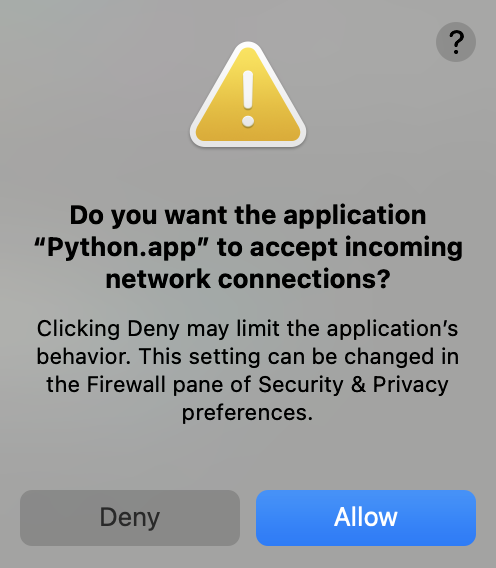

# Debugging your code in Python - Examples

These examples show how to perform debugging on your python applications. They are part of the medium blog [Debugging your code in Python - pdb vs. rpdb]().

The blog goes uses these examples to explain using the python debugger(pdb) and the 
remote python debugger(rpdb).

## Running the Application

Here I'll point to how to run the application. There are a few prerequisites needed
for the Flask webserver (used for testing rpdb).

## Prerequisites

1. Make sure you are using [python3](https://www.python.org/downloads/)
```
$ python --version
Python 3.9.6
```

2. Setup a [virtual environment](https://docs.python.org/3/tutorial/venv.html)
```
$ virtualenv venv
created virtual environment ...

$ source venv/bin/activate
(venv) ➜ $PWD
```

3. Install Requirements
```
$ pip install -r requirements.txt

Collecting flask ...
```

### pdb

In order to test out pdb, we simply run the following:

```
$ python pdb/main.py

Enter some words: I am a cat

> /Users/fernandodiaz/Desktop/debugging/pdb/main.py(23)<module>()
-> num_chars = count(input)
(Pdb)
```

Now in the (Pdb) view we can run the commands as seen in the blog.

### rpdb

In order to test out rpdb, we simply run the following:

```
$ python rpdb/run.py

* Serving Flask app 'remote' (lazy loading)
 * Environment: production
   WARNING: This is a development server. Do not use it in a production deployment.
   Use a production WSGI server instead.
 * Debug mode: on
 * Running on all addresses.
   WARNING: This is a development server. Do not use it in a production deployment.
 * Running on http://192.168.1.147:5000/ (Press CTRL+C to quit)
 * Restarting with stat
 * Debugger is active!
 * Debugger PIN: 926-264-267
```

**NOTE:** Make sure it python is run while inside the virtual environment.

A popup may come up, make sure to allow the connection:


then we open a separate terminal to send a request:
```
$ curl -X POST http://192.168.1.147:5000/ -d '{"message": "This is a message"}'

# It should freeze
```

then go back to the terminal running the web-server and verify that it is
connected to the debugger:
```
...
pdb is running on 127.0.0.1:4444
```

Now let's open another terminal to run rpdb:
```
$ nc 127.0.0.1 4444

> /Users/fernandodiaz/Desktop/debugging/rpdb/remote/routes.py(15)add_note()
-> if not msg:
(Pdb)
```

Now in the (Pdb) view we can run the commands as seen in the blog.
